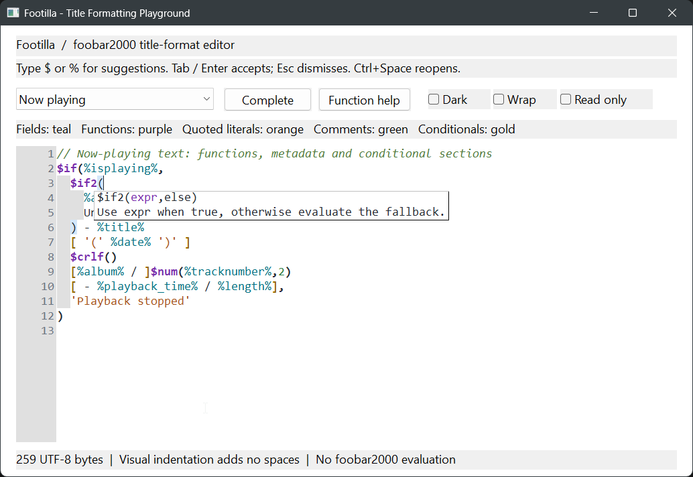
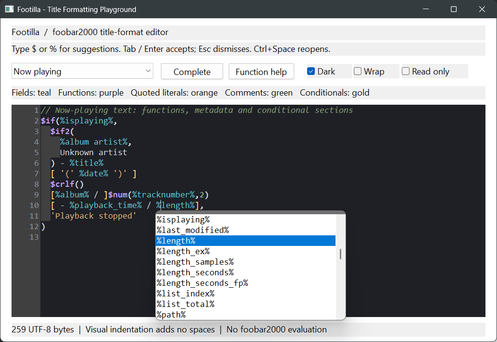

# Footilla

A reusable Win32 text input control for foobar2000 title-format expressions,
built as **footilla.lib**. Ships a Footilla-maintained copy of the Scintilla
editing engine used by SciTE, with Footilla's own title-format container lexer,
completion catalog and call tips.
The engine's object files are included in the library: no Scintilla DLL,
Lexilla DLL, SciTE executable, WTL runtime or foobar2000 SDK is required.

Support for light and dark themes, title formatting, indentation without
whitespace (since whitespace is passed through), autocomplete and parameter
info:




The standalone playground uses C++ and WTL. See
[Embedding in a foobar2000 preferences page](#embedding-in-a-foobar2000-preferences-page)
for the integration pattern used by `foo_nowplaying2`.

## Build

Requires CMake 3.24+, Visual Studio with Desktop development with C++, a Windows
SDK, and ATL for the demo. The demo also requires WTL 10 headers.
The DPI-aware playground targets Windows 10 or later.
Scintilla is included in this repository under `Scintilla`; no external
SciTE/Scintilla checkout or source-path parameter is required.

From this project's directory, using PowerShell:

```powershell
cmake -S . -B build -G "Visual Studio 18 2026" -A x64 `
  -Dwtl="C:\src\c\WTL10" -Dfoobar2000sdk="C:\src\c\foobar2000\sdk"
cmake --build build --config Release --parallel
ctest --test-dir build -C Release --output-on-failure
.\build\Release\footilla_demo.exe
```

Use the Visual Studio generator installed on your machine. `-A Win32` builds
x86 instead; use a separate build folder. Library, engine and consumer must use
the same architecture and MSVC runtime. The project respects
`CMAKE_MSVC_RUNTIME_LIBRARY` instead of overriding a parent's runtime policy.

The build always uses the repository's maintained Scintilla sources. It does
not download sources, apply patches, or access a sibling SciTE installation.

For the library alone, set `FOOTILLA_BUILD_DEMO=OFF`, `FOOTILLA_BUILD_TESTS=OFF`
and `FOOTILLA_BUILD_FOO_TILLA=OFF`; WTL becomes then unnecessary.

## Playground

Type `$` for functions or `%` for fields. Suggestions filter as you type,
case-insensitively, including field names containing spaces. Accept with Tab or
Enter; dismiss with Escape. **Ctrl+Space** opens completion at the current token.
Function completion inserts parentheses and positions the caret inside them
(after them for zero-argument functions), without duplicating existing
parentheses. Completing inside a field replaces its suffix and closing `%`.

**Ctrl+Shift+Space** shows a function signature and description. Typing `(` or
`,` opens argument help; nested calls and quoted commas are handled. The
current parameter is highlighted. Standard Scintilla selection, clipboard,
undo/redo, Unicode editing and brace matching remain available.

Select an example or toggle the editor's dark palette, wrapping and read-only
mode. Outside a popup, Tab/Shift+Tab traverse the demo's controls.
`%datetime%` demonstrates a host-supplied field, not a foobar2000 built-in.

### Visual indentation

Footilla displays a stepped left inset based on nested function calls and
conditional sections. Each level is two space-width columns by default.
The line-number gutter stays straight; the blank strip between it and the text
uses the gutter background. Leading closing delimiters align with their openers,
and blank lines retain the enclosing level.

**The inset is not whitespace.** Enter inserts only the normal newline; it does
not insert spaces or tabs. Text access, selection, copy/paste, save, and undo
continue to operate on the original document bytes. Home goes to the first real
character, and clicking the blank inset positions the caret there. Literal
spaces already present in the expression are neither removed nor hidden.
Comments, quoted literals and field names do not introduce nesting.

Set `Options::visualIndentationWidth` before `Create()`, or call
`Editor::SetVisualIndentationWidth(columns)` on a live control. The getter is
`GetVisualIndentationWidth()`. Zero disables visual indentation; negative widths
are rejected. Changing this display setting does not modify text or undo history.
The width follows the editor font, zoom and DPI. Wrapped continuation lines keep
their document line's inset; extreme nesting is visually limited to leave room
for text when wrapping. This is automatic syntax layout, not manual Tab-based
indentation.

Highlighting distinguishes fields, functions, quoted text, line comments,
conditional sections, punctuation, numbers and unfinished lexical constructs.
This is **editing assistance, not a title-format evaluator or full validator**.
Unknown fields/functions remain valid-looking because components can define
their own. Availability of suggested playback/playlist/component fields depends
on the host's evaluation context. Full-document styling is intentional for
short title-format expressions, rather than large source files.

## Embed in a CMake application or plugin

```cmake
set(FOOTILLA_BUILD_DEMO OFF CACHE BOOL "")
set(FOOTILLA_BUILD_TESTS OFF CACHE BOOL "")
add_subdirectory(path/to/footilla)
target_link_libraries(your_target PRIVATE footilla::footilla)
```

The target propagates C++17, public headers and required Windows libraries.
The public API does not depend on WTL or the foobar2000 SDK.

```cpp
#include <footilla/editor.h>

// Once on your UI thread, outside DllMain. Check the return value.
if (!footilla::Initialize(moduleInstance)) {
    // Report GetLastError() to the host.
    return false;
}

// Keep this object alive for the lifetime of the control (e.g. a dialog member).
footilla::Editor editor;
RECT bounds{10, 10, 600, 240};
if (!editor.Create(parentWindow, 1001, bounds)) {
    return false;
}
editor.SetExtraFields({"datetime"});
editor.SetText("$if2(%artist%,Unknown artist) - %title%");
std::string utf8 = editor.GetText();
```

`SetText`/`GetText` use UTF-8; positions exposed by the language core and
Scintilla use byte offsets, not UTF-16 positions. `SetText` rejects malformed
UTF-8 and embedded NUL with `std::invalid_argument`, clears undo history, and can
update a read-only editor. Other editing operations respect read-only mode.

Move/enable the host HWND returned by `Handle()` as a normal child window.
Use `Focus()` to enter it. Parent dialogs receive coalesced
`WM_COMMAND / EN_CHANGE`, with the host control ID and `Handle()` in `lParam`;
read updated text using `GetText()`. No `WM_NOTIFY` forwarding is required.
`ScintillaHandle()` is available for advanced Scintilla messages; do not replace
its document, lexer, line-inset metadata or notification settings behind Footilla.

This is not a binary-compatible replacement for the Windows `EDIT` class:
use the API instead of `WM_GETTEXT`, `WM_SETTEXT`, or `EM_*` messages.
All editor calls and object lifetimes belong to the initializing UI thread.
Destroying the parent detaches the C++ object; destroying the object destroys
its window. Destroy all editors before calling `footilla::Shutdown()`, outside
`DllMain`, before unloading a plugin. `Initialize` is idempotent while initialized,
not reference-counted. `Shutdown` rejects live editors.

**Treat `Shutdown()` as terminal for this loaded component. Do not pair
`Initialize()`/`Shutdown()` with opening/closing an editor or preferences page.**
The current Scintilla backend uses process-lifetime one-time initialization for
its popup classes; a shutdown/reinitialize cycle does not restore those classes.
Keep the runtime alive between editor instances. See the lifecycle guidance below.

Scintilla registers process-global window classes. Do not initialize a second
independently linked Scintilla instance in the same process; initialization
fails rather than silently attaching to another component's engine. A host
already embedding Scintilla needs a coordinated shared engine integration.
The demo initializes OLE on its UI thread for Scintilla drag/drop; embedders
should use their host's existing OLE initialization.

## Embedding in a foobar2000 preferences page

The integration has two layers: Footilla owns the editing window and language
assistance; the plugin owns its preferences state, foobar2000 callbacks, dialog
navigation, theme notifications, and runtime lifetime. A small plugin-side
adapter shared by all Format fields keeps those responsibilities consistent.
These requirements come from embedding Footilla in the Now Playing, Next Up,
and Log tabs of `foo_nowplaying2`.

### Dependency and build setup

From your plugin repository, add and initialize the dependency:

```powershell
git submodule add https://github.com/foxx1337/footilla.git footilla
git submodule update --init --recursive
```

Commit the submodule pointer and `.gitmodules` with your integration. Other
developers should clone with `--recurse-submodules`, or run the update command
after cloning. Link `footilla::footilla` using the CMake setup above; disable
Footilla's standalone demo and tests for normal plugin builds.

Use the same architecture, compatible MSVC toolset, and matching runtime
configuration for the plugin, Footilla, Scintilla, and foobar2000 SDK libraries.
If selecting a per-target `VS_PLATFORM_TOOLSET`, apply it to both `footilla` and
`footilla_scintilla` as well as the plugin. Footilla does not itself require
`foo_nowplaying2`'s v142 release-toolset policy.

If the parent project sets a newer C++ standard, retain Footilla's C++17 build
settings after adding its subdirectory:

```cmake
set_target_properties(footilla footilla_scintilla PROPERTIES CXX_STANDARD 17)
```

Apply the same setting to any optional Footilla demo/test targets you enable.
Ship `Scintilla-License.txt` beside the component DLL and include it in both
normal and debug component packages.

### Keep runtime lifetime separate from window lifetime

Initialize on foobar2000's main/UI thread, outside `DllMain`, passing
`core_api::get_my_instance()` as the module instance. Lazy initialization before
the first editor is sufficient; keep an initialized flag independent of your
count of live editors.

| Event | Plugin responsibility |
| --- | --- |
| First editor creation | Call `footilla::Initialize()` once, check the result, then create the editor. |
| Additional editor creation | Reuse the initialized runtime; create an independent `Editor` instance. |
| Preferences close, tab destruction, or page recreation | Destroy the affected editor windows and release their plugin-side hooks. Keep the runtime initialized even when no editors remain. |
| Component shutdown | Request runtime shutdown; call `footilla::Shutdown()` only after every editor has been destroyed. |
| Creation requested after shutdown begins | Reject it explicitly; do not restart the runtime. |

Register component shutdown through an SDK `initquit` implementation and
`initquit_factory_t`. **`on_quit()` runs before the main window is destroyed**,
so it must not assume preferences windows have already gone away. If editors
are still alive, record a shutdown request and let the last editor's destruction
perform the final cleanup. Report initialization and cleanup failures.

Why this matters: Scintilla registers `ListBoxX` (autocomplete) and `CallTip`
through a `std::once_flag` in `ScintillaWin::SWndProc`. Shutdown unregisters them,
but reopening the main editor does not run that one-time setup again. The editor
can still display and edit text while its popups fail to appear. In the current
backend, failed popup creation can also lead to null-HWND redraw calls and
desktop-wide flashing. This can surface during a theme change or navigation
that recreates a preferences page; it is not evidence that the popup simply
needs a dark-mode subclass.

### Mark every embedded dialog as a control parent

Use `DS_CONTROL` on the plugin's child preferences page and **every nested tab
dialog** that participates in keyboard navigation. For example, a child dialog
template's style line can be:

```rc
STYLE DS_CONTROL | DS_SETFONT | WS_CHILD
```

This establishes `WS_EX_CONTROLPARENT` on the created child dialog. Footilla
already sets that extended style on its own wrapper, but cannot fix its
ancestors. The hierarchy should look like this:

```text
foobar2000 preferences host
  Plugin preferences page        DS_CONTROL
    Embedded tab dialog          DS_CONTROL
      Footilla.Editor            WS_EX_CONTROLPARENT (provided by Footilla)
        Scintilla                Focusable input control
```

A missing intermediate control-parent style can trap Windows' default-button
and keyboard-navigation traversal inside `IsDialogMessage`, making the entire
foobar2000 UI appear deadlocked. Setting the flag only on Footilla is not enough.
This requirement applies to embedded dialogs, not the top-level preferences host.

### Replace the resource control before installing theme hooks

Keep an `Editor` (or the plugin adapter that owns it) as a dialog member. An
existing `EDITTEXT` resource can serve as a position/tab-order placeholder:

1. Find the placeholder by its control ID. Obtain its rectangle and convert it
   from screen coordinates to the containing dialog's client coordinates.
2. Create Footilla with the same parent, control ID, and rectangle. Configure
   its options, plugin-specific completion names, and initial UTF-8 text.
3. Use `SetWindowPos` to place the new wrapper immediately after the placeholder
   in sibling order, without moving, resizing, or activating it.
4. Destroy the placeholder. The replacement now occupies its tab-order position.
5. Install the plugin's theme bridge, then call the dialog's
   `dark_mode_.AddDialogWithControls(...)` so discovery sees the new control,
   not a soon-to-be-destroyed EDIT.

The theme bridge can also be installed immediately after creating Footilla;
the important ordering is that both replacement and bridge precede dark-mode
control discovery. Check failures before removing the placeholder, and surface
an initialization error rather than leaving an editable field that is no longer
connected to saved settings.

The plugin can override appearance without modifying Footilla. For example,
`foo_nowplaying2` configures:

```cpp
footilla::Options options;
options.fontSizePoints = 10;
options.visualIndentationWidth = 2;
options.theme = fb2k::isDarkMode() ? footilla::Theme::Dark : footilla::Theme::Light;
```

Pass these options to `Editor::Create`; set `readOnly` for inherited formats.
Use `SetFont()` for later font changes. `Handle()` is the wrapper used for layout,
control identity, and change notifications. `ScintillaHandle()` is the actual
input window; target it when attaching a hover tooltip or other input-specific
behavior. Use `Focus()` rather than treating the wrapper as a Windows EDIT.

### Connect changes, previews, Apply, and Reset

Footilla sends `WM_COMMAND` with `EN_CHANGE`, the original control ID in
`LOWORD(wParam)`, and the wrapper HWND in `lParam`. A WTL dialog can retain its
usual handler entry:

```cpp
COMMAND_HANDLER_EX(IDC_FORMAT, EN_CHANGE, OnFormatChange)
```

Read the expression through `editor_.GetText()`, compile it with the plugin's
existing `titleformat_compiler` path, refresh the preview, and notify the
preferences callback with `on_state_changed()`. Keep evaluation in foobar2000:
Footilla does not evaluate title-format scripts.

**Change notifications are posted and coalesced, not synchronous EDIT events.**
Apply/dirty-state queries should read the current editor text rather than rely
only on a cache updated by `EN_CHANGE`. Likewise, after a programmatic Reset or
an inherited-format update, compile/refresh immediately if the preview is needed
before the notification is processed. The same consideration applies when
another tab requests a compiled script.

Do not use `uGetDlgItemText`, `uSetDlgItemText`, or `EM_SETREADONLY` on Footilla's
wrapper. Use `GetText()`, `SetText()`, and `SetReadOnly()`. Preserve UTF-8 exactly:
visual indentation adds no characters, and existing literal whitespace must not
be trimmed before saving.

For a "Same as Now Playing" option, save the independent expression before
enabling inheritance, display the source editor's current expression, and make
the dependent editor read-only. Restore the independent expression when
inheritance is disabled. Do not save inherited text over the independent
configuration or compare that inactive configuration against inherited text
when determining the dirty state. Reset must update the text, inheritance flag,
read-only state, and preview together.

Avoid calling `SetText()` when the displayed text is already identical: it clears
undo history and can reset caret/scroll state. `SetText()` can update a read-only
editor without making it editable. `SetExtraFields({"datetime"})` adds suggestions
for a plugin-defined field; the plugin must still supply its evaluation hook.

### Bridge foobar2000 theme changes

Set the initial palette from `fb2k::isDarkMode()`. For live changes, retain
`fb2k::CDarkModeHooks` as a dialog member and provide a plugin-side subclass of
Footilla's **wrapper** that understands `DarkMode::msgSetDarkMode()`:

| `wParam` | Bridge behavior |
| --- | --- |
| `-1` | Return `1` to report support; do not change the theme. |
| `0` | Apply `Theme::Light` and return `1`. |
| `1` | Apply `Theme::Dark` and return `1`. |

The SDK's `AddDialogWithControls` probes controls with that message and registers
supported controls for later updates. This avoids treating Footilla as a standard
EDIT. If theming native scrollbars too, apply `SetWindowTheme` to
`ScintillaHandle()` with `Explorer` or `DarkMode_Explorer`, and check the HRESULT.
Changing the Footilla palette alone does not theme native Windows scrollbars.

Use `DefSubclassProc` for unhandled messages, remove your subclass on
`WM_NCDESTROY`, and keep the adapter alive until its window is destroyed.
Do not allow C++ exceptions to escape the callback. Clear dialog-owned theme
registrations when their windows are destroyed: the SDK stores HWNDs, so old
registrations cannot be reused for replacement controls. Reapply discovery to
new pages, but **do not shut down/reinitialize Scintilla to change themes**.

### Exercise the full preferences lifecycle

An editor that renders correctly once is not sufficient coverage. In addition
to text round-trips, test the complete nested dialog hierarchy through
`IsDialogMessage`, moving focus between a default button, the Scintilla input,
and the next field. Bound navigation tests with a timeout so a traversal loop
cannot hang the test runner.

Open and close/recreate all editor-owning pages repeatedly, including after
light/dark switches. Verify that actual `ListBoxX` and `CallTip` windows are
created and visible, and that a completion can be accepted. Checking only
`SCI_AUTOCACTIVE` or the main editor's appearance can miss failed popup creation.
Also cover inherited-format restoration, Reset, Apply before queued changes
are delivered, and both immediate and deferred component shutdown.

## Source and redistribution

Syntax and the built-in catalog are based on the
[Hydrogenaudio title-format reference](https://wiki.hydrogenaudio.org/index.php?title=Foobar2000:Title_Formatting_Reference).
Catalog descriptions are concise original summaries, not copied article text.

### Maintained Scintilla sources

`Scintilla` contains the static Win32 engine sources and their transitive header
dependencies, copied unchanged from **Scintilla 5.6.6** on 2026-09-12. The original
SciTE/Scintilla source folder is not modified. `Scintilla\version.txt` records
the upstream baseline (`566`); `Scintilla\License.txt` retains the upstream
copyright and redistribution terms.

`Scintilla\src` contains the editor core, `Scintilla\win32` the Windows backend,
and `Scintilla\include` the required public headers and `Scintilla.iface`
interface definition. The initial source list follows the static
`COMPONENT_OBJS` from upstream `win32\scintilla.mak`. DLL entry points/resources,
other platform backends, SciTE, Lexilla and upstream build/generation tools are
not included.

These are ordinary, Footilla-maintained source files, not a submodule or a
build-time overlay. Future engine changes belong directly in this tree;
upstream updates are deliberate merges with the copyright notices preserved.
If an interface change requires regenerating headers, use the matching upstream
generation tools and include the generated headers in the change.
`cmake\Scintilla.cmake` compiles this tree as the `footilla_scintilla` object
target; its objects are included in `footilla.lib`.

The maintained engine adds generic, view-local line insets. The private
`Scintilla\include\ScintillaFootilla.h` messages set a complete array of
nonnegative inset columns and query a line's configured inset. These messages
are Footilla extensions, not upstream Scintilla APIs. `EditModel` owns the
metadata, `Editor` invalidates affected layout, and `EditView` applies the same
pixel inset to painting, caret coordinates, mouse/rectangular hit-testing,
wrapping and horizontal extent tracking. The renderer also uses the inset when
printing. No synthetic characters or runtime hooks are used. Each Scintilla view
defaults to zero inset until its host supplies metadata.

Footilla's language scanner computes the levels and republishes them after
insertions/deletions, including paste and undo/redo. The engine contains no
foobar2000 grammar. The initial upstream baseline remains recorded as 5.6.6;
the code in this tree now includes Footilla's maintained changes.

Redistributing `footilla.lib` or an application linked to it also redistributes
Scintilla. Include the upstream notice copied by CMake to
`build\Scintilla-License.txt` and next to `footilla.lib`. WTL is used only by the
playground; its source distribution's `MS-PL.txt` is copied next to the demo as
`WTL-License.txt` when available.
